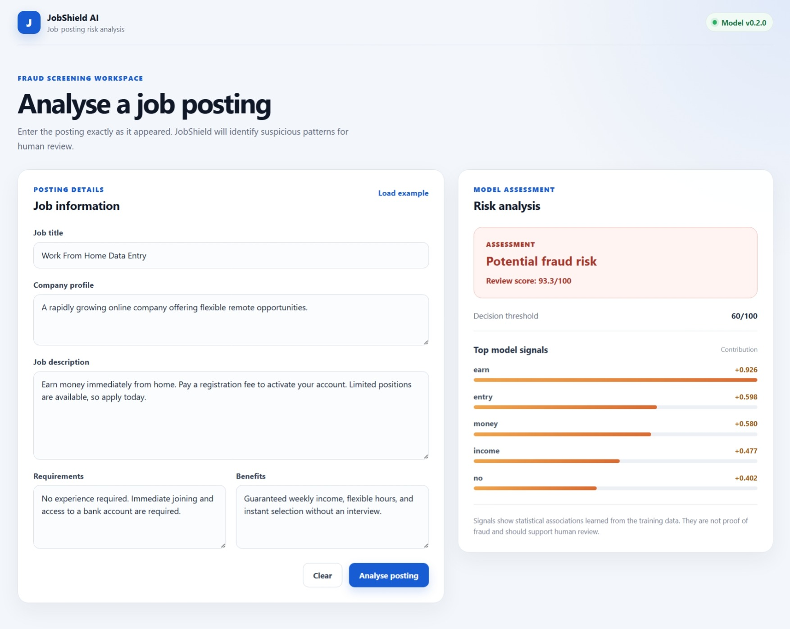

# JobShield AI

JobShield AI is an end-to-end machine-learning system that identifies potentially fraudulent job postings. It combines TF-IDF text features, logistic regression, cost-sensitive evaluation, explainable predictions, FastAPI, and React.

## Live Demo

- Web application: [JobShield AI](https://jobshield-ai-jpmm.onrender.com)
- API documentation: [Swagger UI](https://jobshield-ai-ttyx.onrender.com/docs)
- API health check: [Health endpoint](https://jobshield-ai-ttyx.onrender.com/health)

> The services use Render’s free hosting tier, so the first request may take a short time while the backend starts.

### Application Preview



## Model Performance

Final results on the untouched test set:

| Metric | Result |
|---|---:|
| Precision | 70.78% |
| Recall | 85.16% |
| F1-score | 77.30% |
| ROC-AUC | 97.78% |
| PR-AUC | 84.79% |
| False positives | 45 |
| False negatives | 19 |

The decision threshold is `0.60`. Under the provisional error-cost assumption, missing one fraudulent posting is treated as five times more costly than raising one false alert.

## Features

- Fraud-risk scoring for job postings
- Explainable model signals for individual predictions
- Versioned preprocessing and model artifact
- Cost-sensitive threshold evaluation
- FastAPI prediction service
- Responsive React interface
- Automated model and API tests
- Reproducible training and evaluation scripts

## ML Pipeline

```text
Job-posting fields
        ↓
Consistent text combination
        ↓
TF-IDF vectorization
        ↓
Logistic regression
        ↓
Fraud score
        ↓
Threshold-based classification
```

The vectorizer removes common English stop words while preserving meaningful negations:

```text
no, not, nor, never
```

## Project Structure

```text
JobShield-AI/
├── data/
│   ├── raw/
│   └── processed/
├── frontend/
├── models/
├── notebooks/
├── reports/
├── src/
│   ├── api.py
│   ├── config.py
│   ├── evaluate.py
│   ├── model.py
│   ├── predict.py
│   ├── text_processing.py
│   ├── train.py
│   └── train_production.py
├── tests/
├── requirements.txt
└── README.md
```

## Run the Full-Stack Application

The trained `v0.2.0` model artifact is included, so retraining is not required to run predictions.

### 1. Backend setup

From the project root:

```powershell
python -m venv .venv
.venv\Scripts\Activate.ps1
python -m pip install -r requirements.txt
```

Start FastAPI:

```powershell
python -m uvicorn src.api:app --reload
```

The API runs at:

```text
http://127.0.0.1:8000
```

Interactive API documentation is available at:

```text
http://127.0.0.1:8000/docs
```

### 2. Frontend setup

Open another terminal:

```powershell
cd frontend
npm install
npm run dev
```

Open:

```text
http://localhost:5173
```

## API Endpoints

### Health check

```text
GET /health
```

### Analyse a posting

```text
POST /predict
```

Example request:

```json
{
  "title": "Work From Home Data Entry",
  "company_profile": "",
  "description": "Earn money immediately. Pay a registration fee.",
  "requirements": "No experience required",
  "benefits": "Guaranteed weekly income"
}
```

The response contains the fraud score, classification, threshold, model version, and strongest model contributions.

## Training

Train using the training split:

```powershell
python -m src.train
```

Train the deployment production artifact on the combined training and validation data:

```powershell
python -m src.train_production
```

## Testing

Run backend, model, and API tests:

```powershell
python -m pytest -q
```

Check the frontend:

```powershell
cd frontend
npm run lint
npm run build
```

## Environment Variables

Backend:

```text
ALLOWED_ORIGINS=http://localhost:5173,http://127.0.0.1:5173
```

Frontend:

```text
VITE_API_BASE_URL=http://127.0.0.1:8000
```

See `.env.example` and `frontend/.env.example`.

## Limitations

- Learned associations are specific to the EMSCAD dataset.
- The fraud score is not a calibrated probability.
- Some learned terms may reflect company-specific or template-specific shortcuts.
- Performance may decrease on newer postings or different geographic markets.
- Explanations show statistical contributions, not proof of fraud.
- Predictions should support human review rather than automatically reject postings.
## Run with Docker

Build the backend image:

```powershell
docker build -t jobshield-api:0.2.0 .
```

Run the container:

```powershell
docker run --name jobshield-api -p 8000:8000 jobshield-api:0.2.0
```

Test the health endpoint:

```text
http://127.0.0.1:8000/health
```

Stop and remove the container:

```powershell
docker stop jobshield-api
docker rm jobshield-api
```